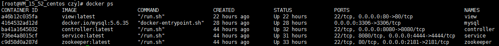
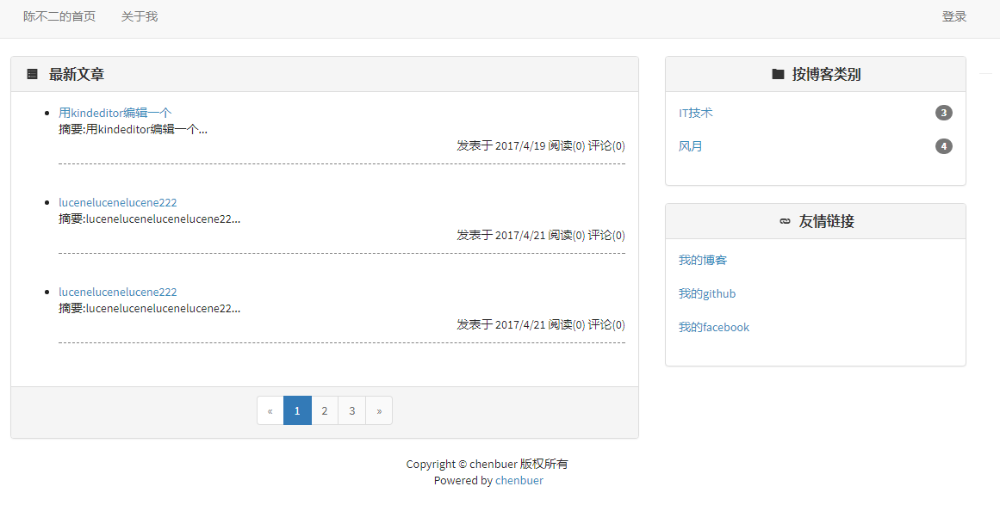
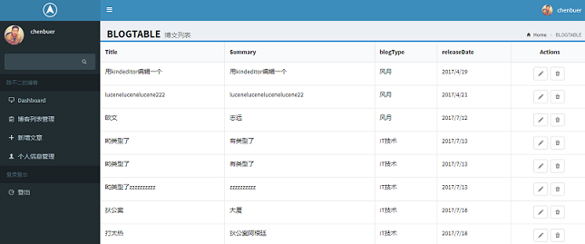
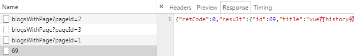

> **这是一套完整的博客系统，这是一个MVC完全解耦的博客系统。整个系统由5个docker容器协同完成，展示如下：**

>如图所示：其中的view代表的是视图层，controller代表的是控制层，service代表的是模型层。

+ **一、视图层**

视图层是基于nodejs，利用vuecli和vue-router完成的SPA(单页面应用程序)。基于RESTful风格，所有的视图展示通过ajax请求完成模型数据的请求来改变。
改应用有完整的文章展示页面

和后台维护系统。

+ **二、控制层**

控制层是基于springBoot开发。它允许前端跨域访问。

+ **三、模型层**

模型层同样也是基于springBoot开发，数据库利用mysql，ORM利用mybatis。

+ **四、服务注册/服务发现**

服务注册/服务发现中心是利用的zookeeper，RPC是利用Dubbo解决方案。

+ **五、数据库**

数据库用的mysql。不表。

**附：**

1. 控制层/模型层代码在我另一个项目里面：[springboot-soa-blog](https://github.com/chenbuer/springboot-soa-blog)

2. 这个项目是基于我原来的一个项目改造而成：[springMVC-blog](https://github.com/chenbuer/springMVC-blog)。这个项目还是传统的MVC单体架构，前后端没有完全解耦。

3. 用的icon库是[ionicons](http://ionicons.com/)

4. 所有的视图层的变化都是依赖于模型的改变：

